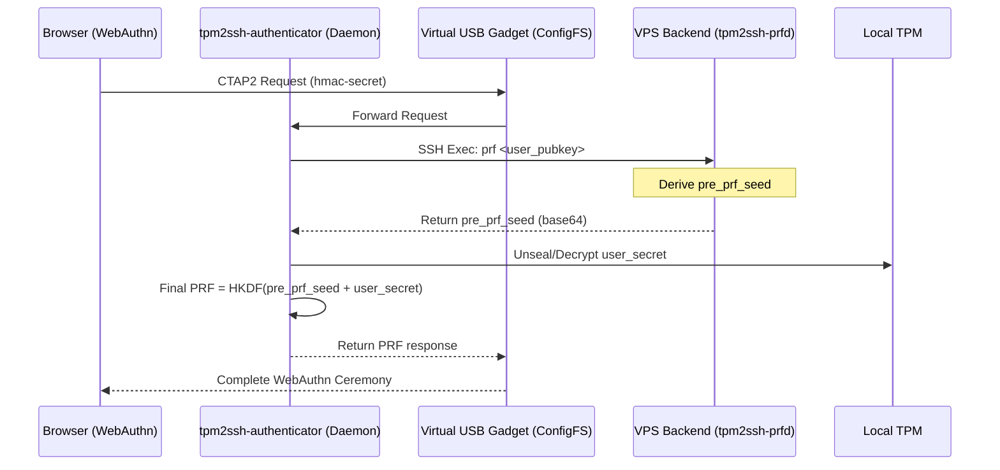

# tpm2ssh PRF Architecture & Implementation Plan

## Overview
`tpm2ssh` is being expanded into a full WebAuthn-compatible HMAC-SECRET/PRF (Pseudo-Random Function) provider. This allows users to leverage their TPM-sealed SSH keys to generate deterministic secrets for end-to-end encrypted applications (like passkeys with PRF support).

### Key Components
1. **`tpm2ssh-prfd` (Service Backend)**: A specialized SSH server (`russh`) that handles accountless registration and provides partial PRF seeds.
2. **`tpm2ssh-authenticator` (User Machine)**: A program that a) registers a Virtual USB HID gadget with the Linux kernel, appearing to the browser as a hardware FIDO2 security key; b) a daemon service listening on WebAuthn PRF requests
3. **`tpm2ssh` (Existing CLI)**: Used for initial setup and providing the signing identities for communication.

---

## Architecture Diagram

---

## Security Model
The "Zero-Knowledge PRF" model ensures neither the VPS nor the user's local machine alone can derive the final secret.

1. **VPS Side**: `pre_prf_seed = HKDF(service_secret + user_id + user_reg_sig)`
   - `service_secret`: Unique to the backend instance.
   - `user_reg_sig`: A signature provided during the authenticated registration (second step of registration).
2. **User Side**: `final_prf = HKDF(pre_prf_seed + user_secret)`
   - `user_secret`: A static secret stored encrypted locally, protected by the user's TPM/key.
   - The VPS never sees the `user_secret`.
   - The user machine never sees the `service_secret`.

---

## Implementation Phases

### Phase 1: VPS Backend (`tpm2ssh-prfd`)
- **Transport**: SSH protocol via `russh`.
- **Registration**: 
    1. `auth_none`: Client sends public key; server stores as `verified: false`.
    2. `auth_publickey`: Client authenticates with the key; server marks `verified: true`.
- **API**: SSH Exec command `prf <pubkey_b64>` returns the partial seed. Authenticated request.
- **Storage**: Simple JSON registry for credentials.

### Phase 2: Platform Authenticator (`tpm2ssh-authenticator`)
- **Setup (Root)**:
    - Configure Linux ConfigFS USB Gadget (HID function).
    - Register as a FIDO2 device.
    - Set up udev rules.
- **Daemon (User)**:
    - Listen on `/dev/hidrawX`.
    - Implement CTAP2 (MakeCredential, GetAssertion).
    - Implement `hmac-secret` extension.
    - Handle User Verification (UV) as per WebAuthn spec.

### Phase 3: Integration & UX
- Finalize the handshake between the authenticator and `tpm2ssh-prfd`.
- Ensure deterministic derivation across restarts.
- (Optional) Browser extension for user secrets/notes/passwords/passkeys management/storage.

---

## Technical Specifications

### tpm2ssh-prfd Dependencies
- `russh`: SSH server implementation.
- `serde_json`: Registry storage.
- `hkdf`/`sha2`: Cryptographic derivation.

### tpm2ssh-authenticator Dependencies
- `cbor`: Protocol encoding for CTAP2.
- `p256`/`ed25519-dalek`: Credential key management.
- `tokio`: Async runtime for HID and SSH communication.
